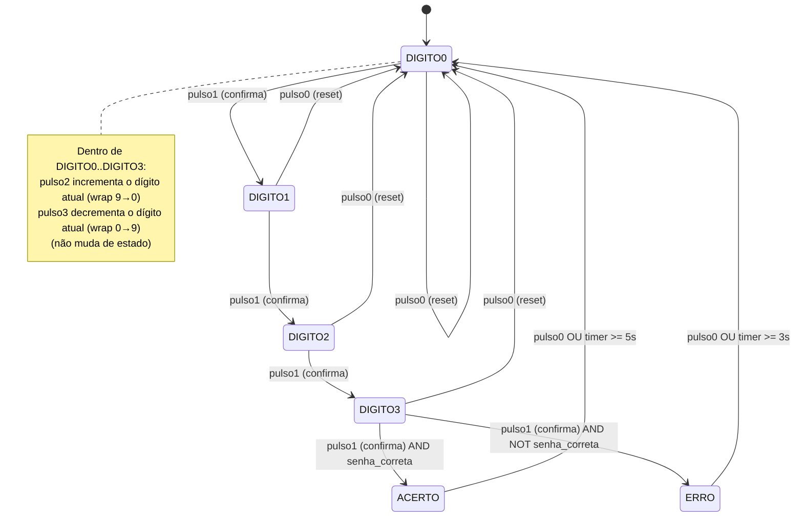

# SafeCrack Pro

Projeto Final — Sistemas Digitais 2026.1
**Grupo:** Felipe Belfort, Gabriel Costa, Gabriel Geller, Lucas Procopio, Pedro Henrique Reynaldo

Simulação de um "cofre eletrônico" implementado em Verilog para a placa DE2 (Cyclone), usando os botões `KEY[3:0]`, os displays de 7 segmentos `HEX0–HEX4` e os LEDs `LEDG`/`LEDR` como interface com o usuário.

---

## 1. Visão geral do funcionamento

O usuário digita uma senha de 4 dígitos (0–9 cada) usando os botões:

| Botão | Função |
|---|---|
| `KEY[0]` | **Reset** — cancela a digitação e volta para o dígito 0 a qualquer momento |
| `KEY[1]` | **Confirma** o dígito atual e avança para o próximo |
| `KEY[2]` | **Incrementa** o dígito atual (wrap 9 → 0) |
| `KEY[3]` | **Decrementa** o dígito atual (wrap 0 → 9) |

Os 4 dígitos digitados aparecem em `HEX3` (dígito 0), `HEX2` (dígito 1), `HEX1` (dígito 2) e `HEX0` (dígito 3). O display `HEX4` mostra qual dígito (posição 0 a 3) está sendo editado no momento.

Ao confirmar o 4º dígito, o circuito compara a senha digitada com a senha fixa **1-2-3-4** (definida pelos parâmetros `S0..S3`):

- **Senha correta** → estado `ACERTO`: acende todos os `LEDG`, permanece por **~5 s** e volta sozinho ao início (ou imediatamente se `KEY[0]` for pressionado).
- **Senha errada** → estado `ERRO`: acende todos os `LEDR`, permanece por **~3 s** e volta sozinho ao início (ou imediatamente com `KEY[0]`).

## 2. Como os requisitos foram implementados

### 2.1 Debounce dos botões

Cada uma das 4 entradas (`KEY[0..3]`) tem seu próprio circuito de debounce, totalmente independente, formado por:

- Um contador de 20 bits (`cnt0..cnt3`) que conta enquanto o botão está pressionado (`KEY[n] == 0`, já que os botões da DE2 são ativos em nível baixo).
- Quando o contador atinge `1.000.000` ciclos de `CLOCK_50` (50 MHz → 20 ns por ciclo), isso equivale a **20 ms** de pressão estável, e o sinal `estavelN` sobe para `1`.
- Um registrador `prevN` guarda o valor de `estavelN` do ciclo anterior.
- O pulso de um ciclo (`pulsoN = estavelN & ~prevN`) é gerado **uma única vez** no instante em que o botão é considerado "pressionado de forma estável", funcionando como detector de borda de subida do sinal debounced.

Isso garante que cada toque físico no botão gere exatamente um pulso lógico, mesmo que o usuário mantenha o botão pressionado por mais tempo.

### 2.2 Máquina de estados (FSM)

A FSM principal tem 6 estados, codificados em `estado`/`prox_estado` (3 bits):

- `DIGITO0`, `DIGITO1`, `DIGITO2`, `DIGITO3` — edição de cada um dos 4 dígitos da senha
- `ACERTO` — senha correta, feedback positivo
- `ERRO` — senha incorreta, feedback negativo

A lógica de próximo estado é puramente combinacional (`always @(*)`), e a transição de estado em si ocorre de forma síncrona no `always @(posedge CLOCK_50)` seguinte. Em `DIGITO0..3`, `pulso1` (confirmar) avança para o próximo dígito; ao confirmar o último dígito (`DIGITO3`), o resultado da comparação `senha_correta` decide entre `ACERTO` e `ERRO`. Em qualquer estado, `pulso0` (reset) tem prioridade e leva de volta a `DIGITO0`.

> **Observação sobre nomenclatura:** os parâmetros `S0, S1, S2, S3` **não são os nomes dos estados da FSM** — eles representam os 4 dígitos esperados da senha (1, 2, 3, 4) usados na comparação `senha_correta`. Os estados de fato são `DIGITO0..DIGITO3`, `ACERTO` e `ERRO`. Essa escolha de nomes é uma fonte comum de confusão na leitura do código (ver seção de *known issues*).

### 2.3 Armazenamento e edição dos dígitos

Os registradores `digito0..digito3` (4 bits cada) guardam o valor atual de cada posição da senha. Dentro do estado correspondente (`DIGITO0..DIGITO3`):

- `pulso2` incrementa o dígito atual, com wrap-around de 9 para 0.
- `pulso3` decrementa o dígito atual, com wrap-around de 0 para 9.
- `pulso0` (reset), ou o retorno automático de `ACERTO`/`ERRO` para `DIGITO0` (por timeout), zera os 4 dígitos de uma vez.

### 2.4 Temporizador de exibição do resultado

Um contador de 28 bits (`timer`) é zerado continuamente enquanto a FSM está em qualquer estado de digitação (`DIGITO0..3`) e passa a contar a partir do momento em que entra em `ACERTO` ou `ERRO`. A volta automática ao início ocorre quando:

- `ACERTO`: `timer >= 250.000.000` ciclos × 20 ns ≈ **5 segundos**
- `ERRO`: `timer >= 150.000.000` ciclos × 20 ns ≈ **3 segundos**

Em ambos os casos, `KEY[0]` permite encurtar essa espera e reiniciar imediatamente.

### 2.5 Saídas visuais

- `LEDG` (9 LEDs verdes) acende totalmente (`9'b111111111`) somente no estado `ACERTO`.
- `LEDR` (18 LEDs vermelhos) acende totalmente (`18'b111...1`) somente no estado `ERRO`.
- `HEX3/HEX2/HEX1/HEX0` mostram, via a função `seg7`, o valor decimal atual de `digito0..digito3` respectivamente.
- `HEX4` mostra a posição do dígito sendo editado (0, 1, 2 ou 3) durante a digitação, e fica apagado (`7'b1111111`) durante `ACERTO`/`ERRO`.

## 3. Diagrama de estados



## 4. Diagramas de tempo (waveforms)

Os diagramas de tempo da simulação (debounce, fluxo de senha correta, senha errada e reset no meio da digitação) são gerados diretamente no **ModelSim**, ao rodar o script `simulate_safecrack.do`. Os sinais já saem organizados em grupos na janela "Wave":

- **ENTRADAS** — `CLOCK_50`, `KEY[3:0]`
- **FSM** — `estado`, `prox_estado`
- **DIGITOS** — `digito0..digito3` (radix decimal)
- **DISPLAYS 7-SEG** — `HEX0..HEX4` (radix binário)
- **LEDS** — `LEDG`, `LEDR`
- **PULSOS DEBOUNCE** — `pulso0..pulso3`

Pontos a observar nos waveforms exportados:

- **Debounce (`pulso2`/`pulso3`):** mesmo com `KEY[n]` pressionado por vários milissegundos, o `pulsoN` correspondente dura apenas **1 ciclo de clock (20 ns)** — é o "sobe `estavelN`, `prevN` segue 1 ciclo depois" que gera a borda detectada por `pulsoN = estavelN & ~prevN`.
- **Senha correta (1-2-3-4):** a cada `pulso1`, `estado` avança (`DIGITO0 → DIGITO1 → DIGITO2 → DIGITO3 → ACERTO`) e `LEDG` sobe por ~5 s antes de `estado` voltar a `DIGITO0`.
- **Senha errada (0-0-0-0):** mesma sequência de avanço de estado, mas terminando em `ERRO`, com `LEDR` ativo por ~3 s.
- **Reset no meio da digitação:** um `pulso0` em qualquer ponto força `estado` de volta a `DIGITO0` e zera `digito0..digito3` no ciclo seguinte, independentemente de quantos dígitos já haviam sido confirmados.

## 5. Known issues / bugs conhecidos

1. **Debounce assimétrico (sem debounce no release).** O contador `cntN` e o sinal `estavelN` são zerados *imediatamente* quando `KEY[n]` volta a 1, sem nenhum filtro de tempo na soltura do botão. Em hardware real, ricochete de contato (bounce) na soltura pode, em tese, gerar uma nova subida espúria antes do próximo toque intencional. Em simulação isso não aparece porque os testes usam transições ideais (sem ruído).

2. **Nomenclatura confusa entre `S0..S3` e os estados da FSM.** Os parâmetros `S0, S1, S2, S3` representam os dígitos da senha esperada (1, 2, 3, 4), e **não** os estados `DIGITO0..DIGITO3` da máquina de estados, apesar do nome sugerir o contrário. Isso é uma armadilha de leitura/manutenção do código, embora não afete o funcionamento.

3. **Senha fixa em hardware (hardcoded).** A senha correta (1-2-3-4) está fixada nos parâmetros `S0..S3` no código-fonte. Não há nenhuma interface (botões extras, chaves `SW`, etc.) para o usuário alterar a senha sem resintetizar o projeto.

4. **Prioridade fixa entre incrementar e decrementar.** Caso `pulso2` e `pulso3` ocorram no mesmo ciclo (cenário improvável fisicamente, mas possível em simulação/teste), o código dá prioridade ao incremento (`pulso2`) via `if/else if`, sem que isso esteja documentado como uma decisão de projeto explícita.

5. **Bloqueio total da entrada durante `ACERTO`/`ERRO`.** Enquanto a FSM está em `ACERTO` (~5 s) ou `ERRO` (~3 s), os botões `KEY[1]`, `KEY[2]` e `KEY[3]` são ignorados — só `KEY[0]` (reset) tem efeito. O usuário não tem como começar a digitar uma nova tentativa antes do fim do tempo de exibição, exceto resetando.

6. **Margem de tempo apertada no debounce do testbench.** O debounce exige 20 ms estáveis (`1.000.000` ciclos de 20 ns) e o testbench pressiona os botões por exatamente 22 ms (`pressiona` task). A margem de 2 ms é confortável em simulação (sinais ideais), mas seria uma margem pequena em um cenário real com jitter de clock ou contatos mecânicos mais lentos.

7. **Task `espera_com_timeout` vazia no testbench.** A task é declarada no testbench (`safecrack_pro_tb.sv`) mas seu corpo está vazio — é código morto que não é usado em nenhum dos 5 testes implementados (o controle de timeout é feito manualmente com `while` + contador `timeout` em cada teste).

8. **`HEX4` não distingue `ACERTO` de `ERRO`.** Em ambos os estados de feedback, `HEX4` fica apagado (`7'b1111111`); a única diferenciação visual entre acerto e erro é via `LEDG` vs `LEDR`, o que pode ser pouco intuitivo se o usuário não estiver olhando diretamente para os LEDs.

---

## 6. Arquivos do projeto

| Arquivo | Descrição |
|---|---|
| `safecrack_pro.sv` (ou `.v`) | Módulo principal (DUT) |
| `safecrack_pro_tb.sv` | Testbench com 5 cenários: reset inicial, senha correta, senha errada, wrap-around, reset no meio da digitação |
| `simulate_safecrack.do` | Script do ModelSim para compilar, simular e configurar o waveform automaticamente |

### Como simular

```tcl
vsim -do simulate_safecrack.do
```

ou, dentro do console do ModelSim:

```tcl
do simulate_safecrack.do
```

> ⚠️ A simulação completa pode levar alguns minutos, pois os timers de `ACERTO` (5 s) e `ERRO` (3 s) são simulados em tempo real de clock (250.000.000 e 150.000.000 ciclos de 20 ns).
